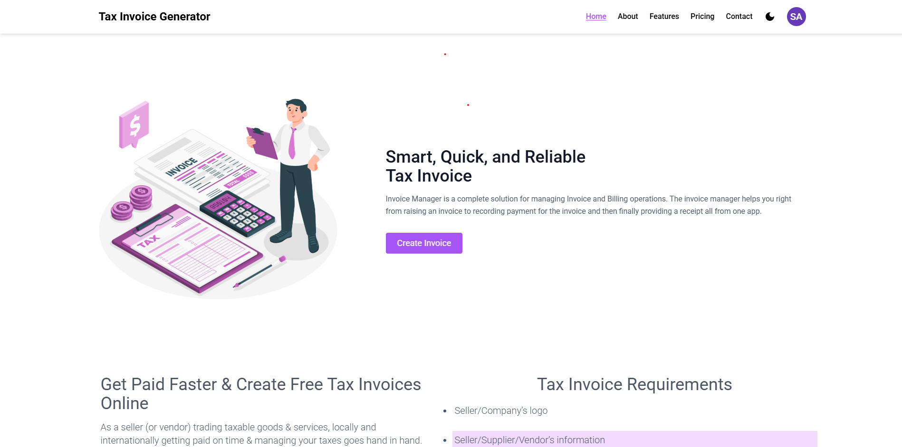
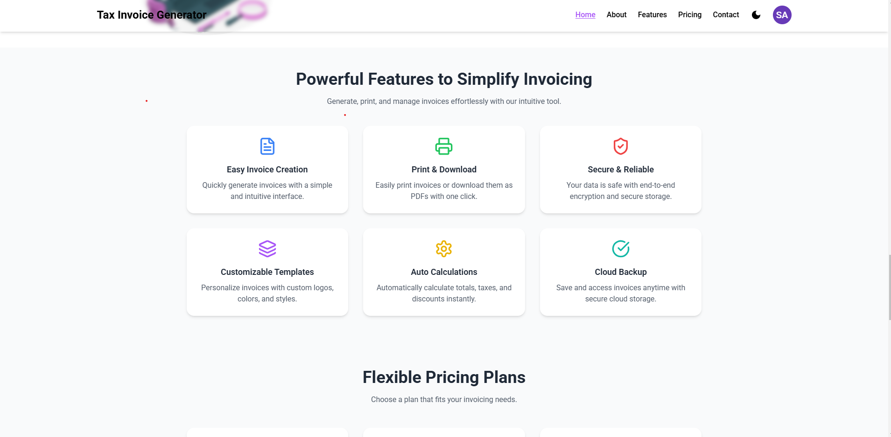

# 📌 Project Name
_A simple and efficient tool to create and manage invoices._


*(Replace this link with an actual screenshot/banner of your project.)*

---
## 📑 About the Project
This **Tax Invoice Generator** is a web application that allows users to easily create and manage invoices. It provides a user-friendly interface to input invoice details, calculate totals, and generate a structured invoice document.

Built with **React, Node.js, Express, and MongoDB**, this project ensures secure authentication, seamless navigation, and efficient data management. Users can log in, save invoice details, and access them anytime.

### Key Highlights:
- 📝 **Generate professional invoices** with itemized details  
- 🔒 **Secure authentication** using JWT  
- 📜 **Store invoice data** in MongoDB  
- 📄 **Download or print invoices** with ease  
- 📱 **Responsive design** for all devices  


## 🚀 Features
✅ User authentication (Login, Signup, Logout)  
✅ JWT-based authentication  
✅ Secure password hashing with bcrypt  
✅ Smooth scrolling navigation  
✅ Dynamic URL updates while scrolling  
✅ Sticky navigation bar  
✅ Section-based layout (Home, About, Services, Contact)  
✅ Responsive and mobile-friendly  
✅ MongoDB integration for storing user data  
✅ REST API endpoints using Express.js  

---

## 🚧 Currently Working On
🔹 Enhancing authentication security  
🔹 Improving UI/UX for better user experience  
🔹 Adding new features and API endpoints  
🔹 Fixing bugs and optimizing performance  

---

## 🎥 Demo
_Provide a link to a live demo or a GIF showcasing your project._  
  
*(Replace this link with an actual GIF or screen recording.)*  

---

## 📂 Folder Structure
```
📦 Project-Name
├── 📂 backend
│   ├── 📂 models
│   │   ├── User.js
│   ├── 📂 routes
│   │   ├── authRoutes.js
│   ├── 📂 controllers
│   │   ├── authController.js
│   ├── server.js
├── 📂 frontend
│   ├── 📂 src
│   │   ├── 📂 components
│   │   │   ├── Header.js
│   │   │   ├── Home.js
│   │   │   ├── About.js
│   │   │   ├── Services.js
│   │   │   ├── Contact.js
│   │   ├── App.js
│   │   ├── index.js
│   │   ├── styles.css
├── 📜 README.md
├── 📜 package.json
```

---

## 🛠️ Installation & Setup

1️⃣ Clone the repository  
```sh
git clone https://github.com/yourusername/project-name.git
```

2️⃣ Navigate to the project folder  
```sh
cd project-name
```

3️⃣ Install dependencies  
```sh
npm install
cd backend && npm install
```

4️⃣ Start the backend server  
```sh
cd backend
npm start
```

5️⃣ Start the frontend server  
```sh
cd frontend
npm start
```

---

## 📸 Screenshots
| Features Page  | 
|------------|------------|---------------|--------------|
|  |

---

## 🔗 Technologies Used
### Frontend
- **React** – for building UI  
- **React Router** – for navigation  
- **React Scroll** – for smooth scrolling  
- **Tailwind CSS** – for styling  

### Backend
- **Node.js** – for server-side logic  
- **Express.js** – for handling routes  
- **MongoDB & Mongoose** – for database operations  
- **JWT** – for secure authentication  
- **bcrypt** – for password hashing  

---

## 💡 Usage
1. Register or login to access protected routes.
2. Click on the navigation links to scroll to different sections.
3. Enjoy a secure and smooth single-page experience!

---

## 💙 Contributing
We welcome contributions! Feel free to:
- Open an issue 🔧  
- Create a pull request 🚀  

---

## 📧 Contact
For any queries or suggestions:  
📩 Email: mohdsuhail2762@gmail.com  
🌐 GitHub: [Suhail1102](https://github.com/Suhail1102)  

---

## 📜 License
This project is licensed under the **MIT License**.  

---

### 🎯 *If you like this project, don't forget to ⭐ star the repo!* 🚀✨

